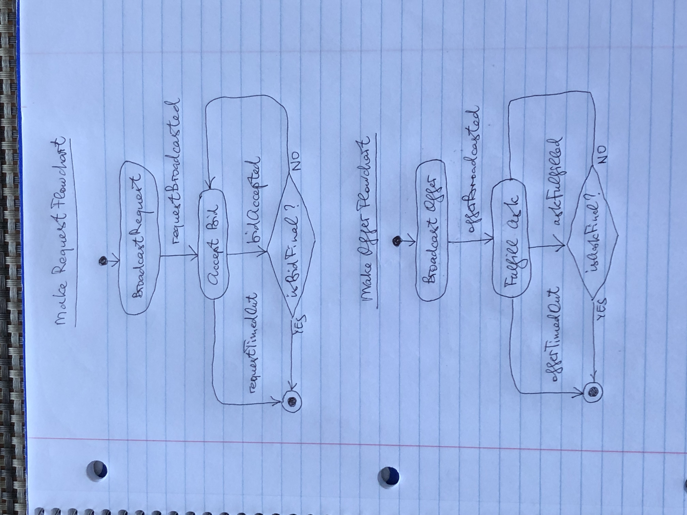

# 👷 Reviving Gratzio, the Stellar-based Favor Exchange

## The Pitch

Need a ride, but there's no Uber or Lift in the vicinity? No problem! Use Gratzio - make a request! Selling your place and no Zillow in your area? No problem! Use Gratzio - make an offer! Have some fresh catch to share with your neighbors? Use Gratzio - make an offer! With Gratzio, you can exchange favors with your neighbors as easily, as around the world. And it is SAFE.

## The Details

The project's goal is to establish a Distributed Autonomous Organization (DAO), whose members (users) exchange favors with each other. The DAO is [Stellar](https://stellar.org/)-based. To join it, the **user** goes to the (demo) website [https://gratzio.w3spaces.com](https://gratzio.w3spaces.com). This results in a request for the **agent** to:

- create a Stellar account for the user;
- create a trustline from this account to the project's **GRAT issuer**;
- fund the account with the initial amount of the project's asset **GRAT**.

When the account is funded, its holder can do favors to other users for more GRAT, and/or send GRAT to other accounts in exchange of favors from their holders.

When a user makes a favor request, the description of the request is being broadcast to all other users who are listening for requests at the moment. Those who want to take the request, bid on the request and then wait for the requestor to accept the bid. One or more accepted bidders deliver the favor and receive the gratitude (some amount of GRAT).

If the requestor, who already sent the gratitude to the bidder, does not get the favor from the bidder, the requestor opens the dispute case with the agent. If the bidder is unable to prove to the agent the delivery of the favor, the agent confiscates the gratitude from the bidder and sends it back to the requestor.

When a user makes a favor offer, the description of the offer is being broadcast to all other users who are listening for offers at the moment. Those who want to take the offer, ask for the offer and then wait for the offerer to fulfill the ask. One or more fulfilled askers get the offered favor and send the gratitude to the offerer.

If the asker, who already sent the gratitude to the offerer, does not get the offered favor from the offerer, the asker opens the dispute case with the agent. If the offerer is unable to prove to the agent the delivery of the favor, the agent confiscates the gratitude from the offerer and sends it back to the asker.

Requestors make requests, offerers make offers; hence they are makers. Accepted bidders take requests, fulfilled askers take offers; hence they are takers. The Gratzio user can be a maker and/or a taker. Or she can be idle.

### The Make Flowcharts

## See also

[GDF Mandate](https://github.com/amissine/gratzio-join/blob/main/GDF.md)

[Gratzio TESTNET Demo Part 1, silent video recording](https://youtu.be/_lPtvGTF7yo)

[Gratzio TESTNET Demo Part 2, silent video recording](https://youtu.be/RX0DNZQNDdA)

[Gratzio TESTNET Demo Part 3, silent video recording](https://youtu.be/l8jKvAos-KE)
